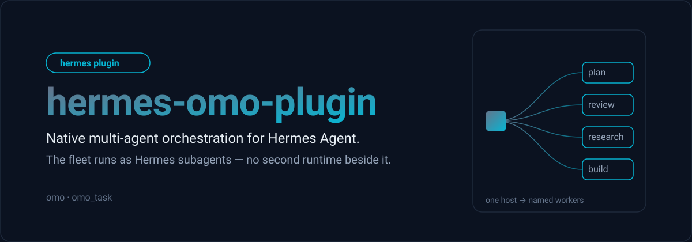

<div align="center">



<!-- SHIELDS_BADGES -->
[](https://github.com/jomakori/hermes-omo-plugin/actions/workflows/ci.yaml)
[](https://github.com/NousResearch/hermes-agent)
[](https://www.python.org)
<!-- /SHIELDS_BADGES -->

</div>

Native OMO multi-agent orchestration for [Hermes Agent](https://github.com/NousResearch/hermes-agent). It runs a fleet of specialised agents — an orchestrator, planners, critics, researchers and engineers — as Hermes subagents, using the host's own lifecycle, sessions, events and transcripts rather than a second runtime beside it.

## Proof

`ci.yaml` runs the test suite on the Python versions in the workflow, `ruff check` and `ruff format --check`, and a guard that fails if a persona prompt still carries an unresolved template token.

<!--TOC-->

- [Proof](#proof)
- [What it is](#what-it-is)
- [Why it exists](#why-it-exists)
- [How it works](#how-it-works)
  - [Tools](#tools)
- [Fleet](#fleet)
- [Install](#install)
- [Configuration](#configuration)
- [Design notes](#design-notes)
- [Development](#development)
- [Layout](#layout)

<!--TOC-->

## What it is

A Hermes plugin. Hermes loads it at startup, it registers the `omo` and `omo_task` tools, and from then on the host can dispatch work to a named fleet. There is no build step, no binary, and no service to run.

Hermes stays the only user-facing identity. Workers return structured results to the host, and the host synthesises and speaks — a worker never becomes the assistant.

## Why it exists

The fleet used to run behind an OpenCode server reached through a delegation plugin: a forked plugin, a dedicated server pod, and a third-party npm harness, each versioned and reconciled separately. Hermes now exposes the primitives that layer was emulating — subagent lifecycle, delegation, sessions, events, transcripts, tool scoping and provider routing — so the fleet lives here instead.

That removes the middle tier entirely: nothing sits between Hermes and its subagents.

## How it works

```
user → Hermes ─┬─ omo / omo_task ─→ orchestrator ─┬─ planner
               │                                  ├─ critic
               │                                  ├─ researcher
               │                                  └─ engineer
               └──────────────────────────────────┴─ structured results → Hermes → user
```

Each worker is launched through the host's subagent lifecycle, so it inherits the host's session record, event stream and transcript for free. The plugin adds the parts the host does not provide: the roster, per-agent model chains with an owned fallback state machine, per-agent tool scoping, and a run tree the host can print.

### Tools

| Tool | Purpose |
|---|---|
| `omo` | `dispatch` / `status` / `cancel` — the host's entrypoint |
| `omo_task` | Delegate one subtask (`agent=`) or spawn a category worker (`category=`) |

`omo_task` takes exactly one of `agent=` or `category=`.

## Fleet

`roster.py` is the source of truth for who exists, what each may touch, and its default model chain. Persona prompts live in `agents/<name>.md`.

| Agent | Role | Access |
|---|---|---|
| `sisyphus` | Ultraworker | orchestrator |
| `hephaestus` | Deep Agent | engineering |
| `prometheus` | Plan Builder | read-only |
| `atlas` | Plan Executor | orchestrator |
| `metis` | Plan Consultant | read-only |
| `momus` | Plan Critic | read-only |
| `oracle` | Architecture / Reasoning | read-only |
| `librarian` | Research | read-only |
| `explore` | Repository Exploration | read-only |
| `multimodal-looker` | Multimodal Analysis | read-only |
| `sisyphus-junior` | Specialized Execution Worker | category spawns only |

Categories — `quick`, `deep`, `ultrabrain`, `visual-engineering`, `writing` — spawn the execution worker with a category-specific chain.

## Install

Clone into the host's plugins directory, then enable it:

```bash
git clone https://github.com/jomakori/hermes-omo-plugin.git "${HERMES_HOME}/plugins/omo"
```

```yaml
plugins:
  enabled:
    - omo
```

## Configuration

Settings are read through Hermes' plugin config, `plugins.entries.omo.settings`. Model names resolve through the host's provider routing, so use the aliases that routing already exposes.

```yaml
plugins:
  enabled:
    - omo
  entries:
    omo:
      settings:
        mcp_enabled: true
        max_fallback_attempts: 3
        cooldown_seconds: 30
        restore_primary_after_cooldown: true
        chains:
          sisyphus:
            - "<provider>/<model>"
            - "<provider>/<fallback>"
```

Anything omitted falls back to the defaults in `roster.py`.

## Design notes

The interesting decisions, and why they are what they are:

- **Per-agent model, not provider.** The host's subagent launch carries `model` only and derives the provider itself, so per-agent provider routing is not expressible — and not needed here. Per-agent *fallback* is not native either, so this plugin owns it: a retryable classifier plus a cooldown/restore state machine in `orchestrator/chains.py`.
- **Read-only is enforced by hook, not toolsets.** The host's `file` toolset bundles read, write and patch into one unit, and per-tool blocking is rejected at launch — so a `pre_tool_call` guard vetoes writes for read-only sessions (`orchestrator/guards.py`).
- **MCP is scoped by toolset.** MCP servers surface as `mcp-<server>` toolsets, so plane and github access is granted to the orchestrator tier and withheld from the read-only and research tiers.
- **Nesting needs a host setting.** Hermes derives a child's role from its depth and ignores any role a caller passes, so at the host default the entire tree is flat and the orchestrator cannot delegate at all. Raise `delegation.max_spawn_depth` to allow the planning pipeline to nest.
- **Worker approvals.** Subagent worker threads run non-interactive: dangerous commands are refused unless the host opts in via `delegation.subagent_auto_approve`. Ordinary work — files, tests, builds, git — is unaffected, and the plugin leaves the safe default alone.

## Development

```bash
python3 -m venv .venv && ./.venv/bin/pip install pytest ruff
./.venv/bin/python -m pytest tests -q
./.venv/bin/ruff check . && ./.venv/bin/ruff format --check .
```

The persona guard can be run directly:

```bash
grep -oE '\{+[A-Z][A-Z_]{3,}\}+' agents/*.md && echo "unresolved token found" || echo "personas clean"
```

## Layout

```text
plugin.yaml            manifest
__init__.py            entrypoint: register()
roster.py              agent roster — roles, tool scopes, model chains
orchestrator/          engine, model-chain and fallback resolution, guards
tools/                 omo and omo_task schemas and handlers
agents/                per-agent persona prompts
skills/                bundled skill
tests/                 unit tests
```

The plugin version lives in `plugin.yaml`.
