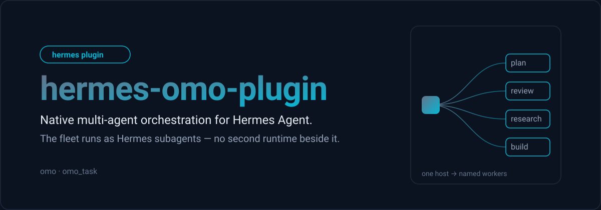

<div align="center">



<!-- SHIELDS_BADGES -->
[](https://github.com/jomakori/hermes-omo-plugin/actions/workflows/ci.yaml)
[](https://github.com/NousResearch/hermes-agent)
[](https://www.python.org)
[](LICENSE)
<!-- /SHIELDS_BADGES -->

</div>

# hermes-omo-plugin

Multi-agent orchestration for [Hermes Agent](https://github.com/NousResearch/hermes-agent). It gives the host a roster of named specialist agents — an orchestrator, planners, critics, researchers and engineers — and runs them as Hermes subagents through the host's own lifecycle. Hermes stays the only user-facing identity: workers return structured results, and the host synthesises and speaks.

The roster and the orchestration model are inspired by [oh-my-openagent](#relationship-to-oh-my-openagent) (OMO). What differs is the substrate — no second runtime to install, pin or reconcile.

## Install

```bash
hermes plugins install jomakori/hermes-omo-plugin
hermes plugins enable omo
```

Or clone it into the host's plugins directory and enable it:

```bash
git clone https://github.com/jomakori/hermes-omo-plugin.git "${HERMES_HOME:-$HOME/.hermes}/plugins/omo"
hermes plugins enable omo
```

## Configuration

Settings are read from `plugins.entries.omo.settings` in the host's `config.yaml`. Model names resolve through the host's provider routing, so use the aliases that routing already exposes.

```yaml
plugins:
  enabled:
    - omo
  entries:
    omo:
      settings:
        mcp_enabled: true
        max_fallback_attempts: 3
        cooldown_seconds: 30
        restore_primary_after_cooldown: true
        escalation_budget_chars: 6000   # payload the premium (last-hop) model receives
        max_attempts_per_agent: 3       # failures of one stage by one agent, engine-wide
        state_path: ~/.omo/runs.json    # where the run registry is persisted
        max_persisted_runs: 50   # runs kept in that record; 0 keeps everything
        max_parallel: 4          # tasks in flight for one graph dispatch
        max_review_cycles: 1     # reviewer passes per task; 0 disables review
        status_message_enabled: true     # one live status message per run
        status_edit_interval: 2.0        # seconds between edits (throttle floor)
        status_move_interval: 0.0        # struct moves (post fresh + delete old); 0 = edit in place, never move
        status_phrase_interval: 3.0      # seconds between rotating phrase lines / activity refresh
        # activity_profiles_dir: /data/profiles   # optional; defaults to <hermes home>/profiles
        enabled_agents: []       # empty = the whole roster; list names to restrict it
        roles:                   # caller-facing role names -> roster entries
          implementer: hephaestus
        chains:
          sisyphus:
            - "<provider>/<model>"
            - "<provider>/<fallback>"
```

Anything omitted falls back to the defaults in `roster.py`.

One host setting matters for the planning pipeline: Hermes derives a child agent's role from its depth and ignores any role a caller passes, so `delegation.max_spawn_depth` must be raised above its default or the tree stays flat and the orchestrator cannot delegate.

## Tools

| Tool | Purpose |
|---|---|
| `omo` | `dispatch` (one task or a whole graph) / `status` / `tree` / `cancel` — the reads and `cancel` are scoped to the calling session unless `all_sessions=true` |
| `omo_task` | Delegate one subtask (`agent=`) or spawn a category worker (`category=`) — attributed to the calling session like any dispatch |
| `jev_ask` | Advisory [TypeSafe Jev](#jev_ask--advisory-decisions) typed-decision classifier (`route_intent` / `gate_risk` / `pick_skill`) — returns a probability envelope; **never executes anything** |

`omo_task` takes exactly one of `agent=` or `category=`.

### `jev_ask` — advisory decisions

`jev_ask` asks [TypeSafe Jev](https://typesafe.ai) — a small **typed-decision classifier** (not a chat model; it returns probabilities over an option set, never text) — for a judgment and hands the result back as a code-authored envelope. It is **advisory by construction**: Jev answers, code decides, and the tool executes nothing.

Three packs ship (`pack=`):

| Pack | Primitives | State keys |
|---|---|---|
| `route_intent` | `choice` tier (trivial/quick/scoped/exploratory/complex/ambiguous) + `choice` domain | `user_message`, `last_question`, `cwd_basename` |
| `gate_risk` | `noul` irreversible / external_side_effect / destructive / secrets_involved | `action_text`, `dry_run` |
| `pick_skill` | `choice` over a caller-supplied shortlist (`skill_shortlist`, ≤255) | `user_request`, `shortlist` |

The envelope is always valid JSON and never raises: `{pack, pack_version, backend, model, status, decisions, usage, cost_usd, latency_ms, notes}`. `status` is `ok` or `unavailable`; on `unavailable` (key missing, timeout, a non-retryable error, or `jev_enabled=false`) the pack's deterministic defaults are returned so the caller branches and continues — nothing blocks. State is **default-deny** (only the pack's allowlisted keys are sent) and **redacted** (bearer tokens, key-like strings, secrets) before it leaves the cluster. Latency is measured client-side — Jev returns none.

Config, under `plugins.entries.omo.settings`:

```yaml
jev_enabled: true                       # false short-circuits to defaults
jev_base_url: "https://api.typesafe.ai"
jev_model: "jev-latest"
jev_timeout_s: 10
jev_api_key_env: "TYPESAFE_AI_API_KEY"  # read from the environment at call time
# jev_thresholds: {destructive: 0.9}    # optional per-primitive overrides
```

Requires the `TYPESAFE_AI_API_KEY` env var. The key is never logged or returned.


Dispatch blocks by default; pass `background=true` to get a `run_id` immediately and poll it with `status`. The flag applies to a `tasks=` graph as well as to a single task: the graph is declared, its `run_id` returned, and the schedule runs off the tool call instead of holding it open until the last task settles. The run registry is **durable**: runs and their workers are checkpointed to `state_path` as they change, so a gateway restart answers `status` from the record rather than from an empty list. A worker whose process is gone is reported `INTERRUPTED` — the record is real, the work it was doing is not verified.

### A run belongs to the session that dispatched it

One gateway process serves every session, so the run registry is shared — an unfiltered `status` would hand one session another's runs, and `cancel` would let it kill work it did not pay for. Each run therefore records its owner's session id, resolved through the host's own bridge (`gateway.session_context`, the accessor Hermes' tools use: the task-local session ContextVar, with `os.environ` as the fallback), and:

- `status` and `tree` answer for **this session's runs only**; the payload carries `session_id` and `scope`, plus `hidden_runs` when records exist that the caller cannot see.
- `cancel` **refuses** a run belonging to another session. The error names the owning session — `run omo_1a2b3c4d belongs to session ses_… , not the calling session (ses_…); pass all_sessions=true to reach across sessions.`
- `all_sessions=true` is the explicit opt-in that lifts the scope for `status`, `tree` and `cancel` — the escape hatch for a deliberate cross-session inspection or takeover.

Attribution degrades safely: a host with no such bridge (or one whose import fails) records no session id rather than failing the dispatch, and a record written **before** attribution existed has no owner at all — it belongs to no session, so it is hidden from a real session's default view and reachable only under `all_sessions=true`. Nothing raises.

Every payload that reports worker activity carries a machine-readable boundary:

```json
"claim_boundary": {
  "boundary": "not_evidence_until_observed",
  "observed": ["status", "model", "cancelled", "error", "client_gone", "result.terminal_state", "result.usage_metadata", "result.tool_execution_summary", "result.error_message"],
  "self_reported": ["result.summary", "result.structured_payload"]
}
```

`observed` is what the engine read from the host's own record of the run. `self_reported`
is what the worker wrote about itself — a claim, not evidence, to be checked against
something the host can see (the working tree, the tests, git) before it is repeated to the
user. A worker that says it refactored a module has not thereby refactored it. Validation
errors (`{"error": "goal is required to dispatch."}`) carry no boundary, because no worker
ran.

## Live status message

Every run owns **one** live struct in the conversation that dispatched it — one
per `run_id`, never a second. It is **edited in place**: posted once and then
updated as the run progresses, so the one message stays current. The struct only
**moves** when `status_move_interval > 0` (it defaults to `0`, which disables
moving): then a changed render is re-posted below the newest message and the
previous copy deleted, so it follows the conversation instead of being buried by
it. A graph run with four workers still owns a single struct; each worker is one
condensed block inside it. So `status_message_enabled: false` turns the whole
surface off.

```
🏗️ omo · omo_304bf8e5 — shell parity across the fleet · 3 workers

OKT-161 · hephaestus · Deep Agent
- run 🔁 t4 · minimax-m3
  ↳ ✍️ write_file components/shell.rs · ⤵ claude-sonnet-5 (rate limit)
- review ⏳

analysis stage · metis · Plan Consultant
- run ⛔ waiting on prometheus
- review ⏳

architecture · oracle · Architecture / Reasoning
- run ⚠️ gateway restart
- review ✅ momus · problems (cycle 1)
```

**Shape.** The goal is stated **once** in the run heading —
`🏗️ omo · <run_id> — <goal≤60>` (`· N workers` appended at fan-out) — and never
repeated per worker. Each worker is then one block whose first line is
`<label> · <agent display>`, where the display is the roster line from
`roster.AgentSpec.display` (`hephaestus · Deep Agent`) and `<label>` is a
condensed form of the task: the ticket id when one is present, else the first
clause, cut on a word boundary to 24 characters at fan-out above 8 (44 otherwise).
A long label is cut at a word boundary and never ends in an ellipsis — no rendered
line does, apart from the deliberate `…N more` collapse marker.

Each block lists three phases in order — `dispatch`, `run`, `review` — one
`- <phase> <emoji>` row each. The `dispatch` row is dropped once the worker has
started (the run row implies it), and the whole `review` row is dropped when the
run was created with `review: false` (read straight off the payload, never
inferred):

| Emoji | Meaning |
|---|---|
| 🔁 | running — the row also carries `<task_id\|run_id> · <serving model>` |
| ⏳ | pending |
| ✅ | done — a finished run row carries its duration (`22m`) |
| 🔍 | reviewing — `reviewer · run_id · task_id:review` |
| ⛔ | blocked on a dependency — the cause is named (`waiting on prometheus`) |
| ⚠️ | interrupted — the cause is named (`gateway restart`) |
| ❌ | failed — the cause is the worker's error, never an echo of the task |
| ⏸ | cancelled — the cancellation cause |
| ⏭ | skipped — mapped by `STATUS_EMOJI`; no live transition emits it yet |

The renderer's map (`orchestrator/status_message.py`, `STATUS_EMOJI`) is the
source of truth for that table; a status the tracker never produces still gets a
glyph rather than `KeyError`.

The 🔁 `run` row is the only one with a line under it: the worker's **real tool
call**, `  ↳ {emoji} {tool} {target}` (emoji resolved from the host registry with
`registry.get_emoji`, capped at ~48 characters), refreshed on the rotation
cadence and changing when the tool changes. When the chain fell back the hop is
appended on that same line (`· ⤵ claude-sonnet-5 (rate limit)`). Until a call is
observable the rotating `  ↳ cycling: <phrase> (3s)` line stands, so the line is
never blank. Review rows are **folded into the producing worker's block** — the
reviewer and verdict are named on the row (`review ✅ momus · problems (cycle 1)`,
`review 🔍 momus · <run> · <task>:review`), never a block of their own. A message
is capped at Discord's 2000 characters: long block lists collapse with `…N more`,
and only if even the headers overflow are trailing blocks folded into `…N more
agents`.

**Delivery.** The struct is posted on the run's first transition and then
**edited in place**, so one message serves the whole run. Moving is opt-in: with
`status_move_interval` above `0` (default `0`, off), once that cadence elapses a
changed render posts a fresh copy below the newest message, deletes the previous
copy, and persists the new id — in that order, so a failed post leaves the
previous struct in place rather than losing the only live one; between moves a
changed render is edited in place. On a **terminal** state the struct never moves:
the final render is an edit, so the last struct stays exactly where it is. The id
is persisted on the run record (`state_path`), so a gateway restart keeps the same
message; a stored id that is **gone** falls back to posting fresh once, never to a
dead edit loop. A move's delete is best-effort — a platform without a deletion API,
or a failed delete, leaves the previous copy behind (the new id is tracked either
way).

**Keeping it alive.** The renderer is pure (`orchestrator/status_message.py`,
run state → exact string) and the throttle/dedupe/move rules are a pure state
machine (`orchestrator/status_tracker.py`, no Discord, no clock — both injected):

- the first render posts; later changed renders edit in place, or — only with
  `status_move_interval > 0` — move past that cadence instead;
- a render whose text is unchanged is skipped entirely (no-op dedupe);
- otherwise edits are throttled to at least `status_edit_interval` (default 2s);
- a throttled change is remembered and flushed on the next tick, so a fast burst
  of transitions never loses the last state;
- the in-progress `run` phrase rotates and the worker's tool call is re-read every
  `status_phrase_interval` (default 3s) so the message stays visibly alive;
- a terminal state **always** forces a final edit, ignoring the throttle — and
  never a move.

**Activity.** The `  ↳` line is read from the worker's own Hermes profile store
(`profiles/<agent>/state.db` → `messages`: `tool_name`, `tool_calls`, `timestamp`)
by `orchestrator/worker_activity.py`. The launch handle names no child session
(`SubagentHandle` carries `subagent_id`/`parent_session_id`/`correlation_id`, and
the child's `sessions` row carries the *parent* id), so the mapping is the
profile's **newest session at launch**, captured once and pinned on the worker;
that is exact for one worker of an agent at a time and approximate when two of the
same agent launch within the same instant. The emoji comes from the host tool
registry at runtime (`registry.get_emoji(tool, default="⚡")`), never a hardcoded
map — the plugin stores no tool→emoji table, so a new tool is rendered the moment
the host registers it. The values the host currently holds for the tools a worker
actually reaches for:

| Tool | Emoji |
|---|---|
| `read_file` | 📖 |
| `write_file` | ✍️ |
| `patch` | 🔧 |
| `search_files` | 🔎 |
| `terminal` | 💻 |
| `skill_manage` | 📝 |
| anything unregistered | ⚡ (the `get_emoji` default) |

Any failure — no session, no DB, a locked or unreadable store — leaves the
canned phrase in place.

Delivery is best-effort by contract: a status message is a courtesy, so a failed
post, move or edit never fails the run it describes. The adapter's HTTP session is bound
to the gateway's event loop, so delivery is **scheduled onto that loop** from the
status worker thread (`asyncio.run_coroutine_threadsafe`) rather than run on a
fresh loop — the same cross-thread hop the host's own dispatch uses. There is **no
plugin-facing "send" verb** (`ctx.platform_actions` exposes only `add_reaction` and
`set_thread_title`), so the transport resolves the adapter through the runner's own
profile-aware, fail-closed `_authorization_adapter` lookup — a documented deviation
from the consent-gated facade, since no capability for this verb exists to grant.
See `orchestrator/gateway_status.py`.

**Events.** Transitions are announced as **bare** event names (the host
namespaces them as `omo:<name>`, so a pre-prefixed name is rejected):

| Event | Emitted at |
|---|---|
| `worker_running` / `worker_succeeded` / `worker_failed` / `worker_cancelled` / `worker_done` | `engine.py` — a worker's status change (`_run_sync`, and the background wrapper) |
| `worker_interrupted` | `engine.py` — a worker recovered as interrupted after a restart, or on shutdown |
| `run_created` | `graph.py` — the run record is written |
| `task_started` / `task_blocked` | `graph.py` — a task is submitted, or blocked on a failed dependency |
| `task_settled` | `graph.py` — a task's future completes |
| `review_verdict` / `reviewer_failed` | `graph.py` — a review returns a verdict, or the reviewer itself fails |
| `run_finished` | `graph.py` — the final payload is built |

A worker event's payload carries the facts the live row needs beyond the ids: the
roster `display`, the serving `model`, the worker's `error` (so a stopped row names
its reason), the chain `hop` it fell back to (empty on success), and the
`activity_session` its tool call is read from. `run_created` carries the `review`
flag the renderer obeys.

## Task graphs

Work with dependencies goes in one call instead of a sequence of dispatches:

```json
{"action": "dispatch", "goal": "harden the sync path", "review": true, "tasks": [
  {"id": "recon",  "agent": "explore",  "prompt": "map how sync works today"},
  {"id": "fix",    "agent": "debugger", "prompt": "fix the race", "depends_on": ["recon"]},
  {"id": "test",   "agent": "tester",   "prompt": "cover the race", "depends_on": ["fix"]},
  {"id": "docs",   "agent": "writing",  "prompt": "note the fix", "depends_on": ["fix"]}
]}
```

Independent tasks run in parallel, bounded by `max_parallel`; a dependent runs only
after its dependencies succeed; a dependent of a failed task is reported `BLOCKED`
and never launched, so a failure cannot silently feed a broken input downstream.
A declaration is rejected before anything runs if ids repeat, a dependency is
unknown or points at itself, a cycle exists, or a task carries both `agent` and
`category` — a rejected graph is rendered as `{"error": ..., "rejected": true}` so
the caller can fix it and resubmit.

## Review cycles

`"review": true` runs `momus` over each successful task and re-runs that task with
the reviewer's notes, at most `max_review_cycles` times (`0` disables it). The
reviewer must answer `{"verdict": "pass"|"problems", "problems": [...]}`; a verdict
the scheduler cannot parse is treated as a pass rather than as a failure, so an
unparseable review can never cause an infinite rewrite. Reviewer workers appear in
the run tree as `<task>:review`.

Every reviewed task reports what the review actually concluded, in
`review_verdict`:

| Value | Meaning |
|---|---|
| `""` | no review ran |
| `pass` | the reviewer passed it, or listed no problems |
| `problems` | the reviewer listed problems; the task was re-run with them |
| `unparsed` | the reviewer answered, but in a shape the scheduler could not read |
| `reviewer_failed` | the reviewer never completed |

Only `problems` re-runs a task. The other outcomes leave it exactly as it was —
but they are named, so "reviewed and clean" is never confused with "the review
could not be read". The verdict is derived from the reviewer's own text, so the
claim boundary files it as self-reported.

## Bounds on the chain walk

A chain walk is cheap until it is not. The last element of every chain is the
premium, quota-bounded route, and a stage that keeps failing re-walks the whole
chain from the primary every time it is dispatched. Three bounds apply.

**The last hop carries a bounded handoff.** Advancing onto the final chain element
sends a brief plus explicit artifacts instead of re-issuing the full launch payload
verbatim: `escalation_budget_chars` (default `6000`, `0` disables) bounds the goal
plus the caller's task context. The worker contract and persona are constant per
agent rather than accumulated payload, so they travel whole — still inside the
host's 32,000-character launch-context cap. Earlier hops are unchanged: a cheaper
model is handed exactly the brief the primary got. What this does *not* bound: the
host builds a child's system prompt from the launch request and adds its own
workspace and project-context blocks, which are not fields of the launch request and
so cannot be trimmed from here.

**Attempts are bounded per agent.** `max_attempts_per_agent` (default `3`, `0`
disables) caps how many times one agent may fail *the same stage* before the engine
refuses another attempt. The host's `max_turns` bounds one agent's loop; it does not
bound how many times this engine will pay for work that is looping. The count is per
`(agent, stage)` and lives engine-wide, so it survives the fallback state that every
dispatch rebuilds from scratch. A cancelled attempt is not a stage failure and does
not consume the budget. The refusal is reported like any other failure, naming the
budget.

**A request whose client is gone is not re-issued.** A `499` — client closed request,
client disconnected — is a hard stop: the walk does not advance onto the next model,
the worker is reported `cancelled` rather than `failed`, and the payload carries
`"client_gone": true`. This holds even when `retry_on_errors` lists `499`: the CLI
behind the disconnect cannot deliver an answer, so re-issuing it only spends input
tokens nobody can receive.

## Hop telemetry

Every dispatch reports `hop_history`: the hops that were tried, in order, each as
`{"model": …, "reason": …}`, and the same list rides on the run row from `status`.
The last entry is the exit point of the cascade — `success` names the hop that
actually served the request, so a primary that answers is still visible as one
entry rather than as silence.

**Reasons.** `billing` (a drained account: HTTP 402, `insufficient balance`,
`add credits`), `rate_limit` (429 or a quota body), `transport` (5xx, timeouts,
connection errors), `semantic` (non-retryable failures, abort, context overflow),
and `success`. Billing is its own bucket because it is not a transient: it says the
account cannot serve at all, which is exactly the case the rest of the chain exists
for.

**Why it matters.** Only the terminal hop used to be visible, which is how a dead
primary or a drained model group stayed hidden: a run that spent four hops looked
identical to a run that answered on the first. Two numbers become readable from
`hop_history` — the fraction of requests that exit at each hop (how much traffic
stops before the premium route), and how much of the failure mass is networking
versus the provider refusing (transport versus semantic). A hop is recorded with a
reason whether it was abandoned or whether it carried the answer.

## Role names

Callers can ask for a role instead of a codename — `explorer`, `researcher`,
`planner`, `implementer`, `tester`, `debugger`, `reviewer`, `security`,
`documenter`, `general` — resolved through `ROLE_ALIASES` and overridable with the
`roles` setting. `documenter` routes to the
`writing` category and `general` to `quick`, so an alias may point at a category
as well as an agent — which is the only way to reach `sisyphus-junior`, a worker
that refuses to be a direct target. Setting `enabled_agents` restricts the
roster; a disabled agent is refused with the list of what is enabled.

## Worker contract

Every launch context opens with the internal-worker contract: the worker is told it
is not the assistant, that user-facing communication is disabled, and that its
findings go back to the orchestrator with what it verified separated from what it
assumed. This is prepended to the persona (and delivered even when a roster entry
has no persona), so it cannot be lost by editing a prompt — the host also never
gives a worker a channel to the user, so the contract states a fact rather than
asking for compliance.

The clause travels in the launch *context*: a child's system prompt is built by the
host and a plugin cannot replace it. A live probe (2026-09-22) asked a worker to
name itself and it answered "Hermes", so treat the wording as guidance rather than a
guarantee. The guarantee is architectural — a worker has no channel to the user, so
whatever it calls itself never reaches one.
## Fleet

`roster.py` is the source of truth for who exists and its default model chain. Each agent's persona is `agents/<name>.md`, delivered per dispatch (see below) and loadable in full as `skill_view("omo:<name>")`.

| Agent | Role |
|---|---|
| `sisyphus` | Ultraworker |
| `hephaestus` | Deep Agent |
| `prometheus` | Plan Builder |
| `atlas` | Plan Executor |
| `metis` | Plan Consultant |
| `momus` | Plan Critic |
| `oracle` | Architecture / Reasoning |
| `librarian` | Research |
| `explore` | Repository Exploration |
| `multimodal-looker` | Multimodal Analysis |
| `sisyphus-junior` | Specialized Execution Worker |
| `tester` | Test Author |
| `debugger` | Defect Investigator |
| `security` | Security Reviewer |

Categories — `quick`, `deep`, `ultrabrain`, `visual-engineering`, `writing` — spawn the execution worker with a category-specific chain.

## How it works

Every worker is launched through the host's subagent lifecycle, so it inherits the host's session record, event stream, transcripts, tool scoping and provider routing. The plugin supplies what the host does not: the roster, per-agent model chains with an owned fallback state machine, a task-graph scheduler, and a run tree the host can print.

A few decisions are worth knowing because they are not obvious:

- **Per-agent model, not provider.** The host's launch carries `model` only and derives the provider itself. Per-agent fallback is not native either, so it is owned here — a retryable classifier plus a cooldown/restore state machine in `orchestrator/chains.py`.
- **Personas are delivered, not assumed.** A worker's `agents/<name>.md` goes into its launch `context`, wrapped in an authoritative binding preamble, so the definition actually reaches the model rather than sitting in the repo unread. The host caps a launch's context at 32,000 chars, which every persona fits whole except `sisyphus`, which is truncated with a pointer to the full text. Every persona is also registered as a plugin skill — `skill_view("omo:<name>")` — so the complete definition is always retrievable.
- **No per-agent permission tier.** Hermes derives a child's capabilities from its parent and refuses a launch whose toolsets are not a subset of the parent's. An earlier read-only tier could not be expressed that way, and the `pre_tool_call` guard that stood in for it never fired — it was keyed on a `session_id` the host does not send. It has been removed rather than repaired: every agent runs with the parent's capabilities, and the roster carries no permission field to mislead.
- **The registry is on disk, not in memory.** Every run keeps a record: created, then written again at each worker's terminal state. A restart adopts that record and names what it cannot stand behind — a worker that was still running reads `INTERRUPTED`, with the work it was doing marked unverified. What it does not do is resume: the process is gone, so the caller checks the worktree, branch or PR before re-dispatching the same work.
- **Worker approvals.** Subagent worker threads run non-interactive and refuse dangerous commands by default; ordinary work — files, tests, builds, git — is unaffected.
- **Registration is unconditional.** `register_tool` is required and fails loudly if the host lacks it; `register_command`, `register_skill` and `on_unload` are each attempted on their own, so a host missing one still gets the others. Nothing branches on a host attribute's presence: an attribute that exists but does nothing would send the whole path down a branch that registers nothing while the plugin still reports as enabled.

## Relationship to oh-my-openagent

This plugin is an adaptation of [oh-my-openagent](https://github.com/code-yeongyu/oh-my-openagent) (formerly oh-my-opencode) for Hermes.

- **Reused:** the agent roster and personas, and the category routing model.
- **Replaced:** OMO's runtime coupling. OMO ships as an OpenCode plugin — OpenCode and Bun, the `@opencode-ai` SDK, an `opencode.json` plugin entry, its lifecycle hooks and its `omo.jsonc` config surface. Here the host's own plugin, delegation and config primitives stand in for all of it, so the same roster runs with nothing extra to install.
- **Not affiliated:** this is an independent, unofficial adaptation and is not produced or endorsed by OMO's authors.

## Development

```bash
python3 -m venv .venv && ./.venv/bin/pip install pytest ruff
./.venv/bin/python -m pytest tests -q
./.venv/bin/ruff check . && ./.venv/bin/ruff format --check .
```

CI runs the suite, both ruff gates, and a guard that fails if a persona prompt still carries an unresolved template token.

## Attribution

The agent roster, personas and categories originate in [oh-my-openagent](https://github.com/code-yeongyu/oh-my-openagent) by code-yeongyu. The persona prompts under `agents/` are ported from it.

**License note:** upstream OMO is **not open source**. It is source-available under the **Sustainable Use License v1.0** (SUL-1.0), which permits use and modification for personal or internal business purposes but restricts commercial use and redistribution. The files under `agents/` therefore remain under that licence and are not relicensed here — see [`THIRD-PARTY-NOTICES.md`](THIRD-PARTY-NOTICES.md).

## License

[MIT](LICENSE) for everything this repository originates. The persona prompts under `agents/` are derived from oh-my-openagent and stay under its licence — see [`THIRD-PARTY-NOTICES.md`](THIRD-PARTY-NOTICES.md).

The plugin version lives in `plugin.yaml`.
